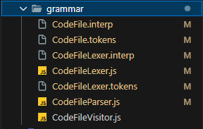

# EDITOR DE CODIGO ONLINE

## **ANTLR**

### **¿QUE ES ANTLR?**

ANTLR (ANother Tool for Language Recognition) es un generador de analizadores léxicos, sintácticos y semánticos. ANTLR 4 es una versión específica de ANTLR que es muy popular para la creación de parsers y analizadores para diversos lenguajes de programación y sistemas de procesamiento de lenguaje natural.

ANTLR 4 utiliza gramáticas de entrada para generar código fuente que puede analizar y reconocer estructuras de lenguajes definidos por el usuario. Es ampliamente utilizado en la industria de desarrollo de software para tareas como análisis de código, compilación de lenguajes de programación, interpretación de scripts y procesamiento de lenguaje natural, entre otros.


[https://www.antlr.org/](https://www.antlr.org/)
___

### **MI GRAMATICA**

La gramática define la estructura de un archivo de código con reglas para declaraciones, asignaciones, impresiones y expresiones. Las declaraciones pueden ser simples o con asignaciones de valores. Las asignaciones asignan valores a variables. Las impresiones muestran mensajes usando printf(). Los mensajes pueden ser texto, expresiones o variables. Los tipos de datos son "margit", "radahn" y "godrick". Las expresiones incluyen operaciones matemáticas, números enteros, variables y paréntesis para agrupar.
___

#### CodeFile.g4
```antlr
grammar CodeFile;

// Importa las reglas del lexer que se usarán en este parser
import LexerRules;

// La regla de inicio de la gramática
start: INSERT CODE '{' content '}';

// La regla 'content' representa el contenido dentro de las llaves
content: expresiones*;

// La regla 'expresiones' representa las diferentes formas de expresiones
expresiones:
            declaraciones
            |
            asignaciones
            |
            imprimir
            ;

// La regla 'declaraciones' representa declaraciones de variables
declaraciones:
            tipo ID SEMI                                          #declaracion
            |
            tipo ID '=' expr SEMI	                              #declaracionasignacion
            ;

// La regla 'asignaciones' representa las asignaciones de valores a variables
asignaciones: ID '=' expr SEMI
;

// La regla 'imprimir' representa la instrucción para imprimir mensajes
imprimir: 'printf(' mensaje ')' SEMI
;

// La regla 'mensaje' representa lo que se puede imprimir (puede ser texto, una expresión o una variable)
mensaje: 
      TEXTO
      |expr
      |ID;

// La regla 'tipo' representa los diferentes tipos de datos que pueden tener las variables
tipo:
    'margit'
    |
    'radahn'
    |
    'godrick'
    ;

// La regla 'expr' representa las expresiones matemáticas y valores
expr: expr op=('*' | '/') expr # MulDiv
| expr op=('+' | '-') expr #AddSub
| INT #int
| ID #id 
| '(' expr ')' #parens
;
```
___

#### LexerRules.g4

```antlr
lexer grammar LexerRules;

INSERT: 'iniciar';
INT: [0-9]+;
CODE: 'codigo';
ID: [a-zA-Z]+;		
SEMI: ';';
MUL: '*';
DIV: '/';
ADD: '+';
SUB: '-';
TEXTO: '"' (~["])* '"';
WS: [ \t\r\n]+ -> skip; // Permitir espacios en blanco, tabulaciones y caracteres de nueva línea
```
___

## **ARCHIVOS**

#### **ANALIZADOR LEXICO Y SINTACTICO**


1. **CodeFileLexer.js:** El lexer (analizador léxico) en ANTLR se encarga de dividir el flujo de entrada en tokens, que son unidades léxicas básicas del lenguaje que se está analizando. 

2. **CodeFileParser.js:** El parser (analizador sintáctico) en ANTLR, se encarga de analizar la estructura de la entrada según las reglas sintácticas definidas en la gramática. Su tarea principal es construir un árbol de análisis sintáctico que represente la estructura jerárquica del código fuente.

3. **CodeFileVisitor.js:** Un archivo JavaScript que contiene la implementación del patrón de diseño Visitor para recorrer el árbol sintáctico generado.

4. Otros archivos relacionados con la generación del analizador léxico y sintáctico en JavaScript, como archivos de configuración y utilidades auxiliares.

Estos archivos son generados por el comando: 
```
antlr4 -Dlanguage=JavaScript -o ./src/grammar -visitor -no-listener ./grammar/CodeFile.g4
```
Apartir de la gramatica definida.
___
#### **GENERATOR.JS**

```javascript
import antlr4 from "antlr4"; // Importa la biblioteca antlr4
import CodeFileLexer from "../../grammar/CodeFileLexer.js"; // Importa el Lexer generado por ANTLR4
import CodeFileParser from "../../grammar/CodeFileParser.js"; // Importa el Parser generado por ANTLR4
import CustomVisitor from "../helper/CustomVisitor.js"; // Importa el visitante personalizado
import CustomErrorListener from "../helper/CustomErrorListener.js"; // Importa el listener de errores personalizado

//Función para analizar el código de entrada.
export const analizar = (input) => {
  const chars = new antlr4.InputStream(input); // Crea una secuencia de caracteres a partir del código de entrada
  const lexer = new CodeFileLexer(chars); // Crea un Lexer personalizado para el código de entrada
  const tokens = new antlr4.CommonTokenStream(lexer); // Crea un flujo de tokens a partir del Lexer
  const parser = new CodeFileParser(tokens); // Crea un parser para el flujo de tokens
  const customErrorListener = new CustomErrorListener();

  //Objeto para manejar errores léxicos
  const errorListener = {
    syntaxError(recognizer, offendingSymbol, line, column, msg, e){
        const mensajeError = `\nError lexico: en linea ${line}:${column} - ${msg}`
        customErrorListener.ErrorsListener.push(mensajeError);
        return customErrorListener.ErrorsListener;
      }
    }
  
  lexer.removeErrorListeners();// Remueve los listeners de error por defecto del Lexer

  lexer.addErrorListener(errorListener); // Agrega los Errores del objeto que maneja errores lexicos

  parser.removeErrorListeners(); // Remueve los listeners de error por defecto del Parser

  parser.addErrorListener(customErrorListener);// Añade el listener de error personalizado al Parser

  parser.buildParseTrees = true; // Habilita la construcción de árboles de análisis
  const tree = parser.start(); // Comienza el análisis sintáctico desde el símbolo inicial


  // Verifica si hay errores léxicos o sintácticos
  if (customErrorListener.hasErrors()) {
    return customErrorListener.getErrorSintaxis(); // Retorna los errores encontrados
  }

  const customVisitor = new CustomVisitor(); // Crea un visitante personalizado
  const resultado = customVisitor.visitStart(tree); // Realiza la visita al árbol de análisis

  // Verifica si hay errores durante la visita al árbol
  if (customVisitor.contErrores()) {
    return customVisitor.getError(); // Retorna los errores encontrados durante la visita
  }


  return resultado; // Retorna el resultado del análisis
}
```
El **Generator.js** define una función llamada **analizar** que utiliza la biblioteca ANTLR4 para analizar código de entrada. Primero, convierte el código de entrada en una secuencia de caracteres y luego crea un lexer personalizado y un parser para procesar esta entrada. Se emplean objetos personalizados para manejar errores léxicos y sintácticos, los cuales son registrados durante el análisis. 
___

#### CUSTOMVISITOR.JS
```javascript
/**
 * Clase CustomVisitor
 * Extiende la clase CodeFileVisitor generada por ANTLR4
 * Define métodos para visitar diferentes nodos del árbol de análisis sintáctico.
 * Además, gestiona variables y errores durante el análisis del código.
 */
import CodeFileVisitor from "../../grammar/CodeFileVisitor.js";
import CodeFileParser from "../../grammar/CodeFileParser.js";

export default class CustomVisitor extends CodeFileVisitor {
	constructor() {
		super();
		this.variables = {
			"margit": [],
			"radahn": [],
			"godrick": []
		};
		this.errors = [];
	}
	
	// Método para verificar si hay errores durante el análisis.
	contErrores(){
		return this.errors.length > 0;
	}
	
	// Obtener las variables y sus valores definidos
	getVariables(){
		const variables = this.variables;
		const result = [];
		for (const variable in variables) {
			if (variables.hasOwnProperty(variable)) {
				const variableArray = variables[variable];
				variableArray.forEach(item => {
					const variableStr = `${variable} id = ${item.id} value = ${item.value}`;
					result.push(variableStr);
				});
			}
		}
		return result.join('\n'); // Unir los resultados en una sola cadena separada por saltos de línea
	}
	
	// Método para obtener los errores encontrados durante el análisis.
	getError(){
		const errores = ['Se han encontrado errores durante el análisis']
		const errors = this.errors;
		errors.forEach(error => {
			const erroresDe = `${error}`
			errores.push(erroresDe)
		});
		return errores.join('\n');
	}
	
	// Visit a parse tree produced by CodeFileParser#start.
	visitStart(ctx) {
		this.visitChildren(ctx);
		if (this.errors.length > 0) {
		  this.errorEncountered = true; // Marcar que se ha encontrado un error
		  console.log("Se han encontrado errores durante el análisis.");
		  return this.getError();;
		}
		return console.log(this.getVariables());
	}
	
	// Visit a parse tree produced by CodeFileParser#content.
	visitContent(ctx) {
		return this.visitChildren(ctx);
	}

	// Visit a parse tree produced by CodeFileParser#declaracion.
	visitDeclaracion(ctx) {
    const tipo = ctx.tipo().getText();
		const id = ctx.ID().getText();
		
		let is_variable_defined = this.variableExist(id);
		if (!is_variable_defined){
			this.variables[tipo].push({"id":id, "value": undefined});
		} else {
			this.errors.push(`La declaracion de "${id}" está repetida`);
		}
		
		return [tipo, id];
	}
	
	visitAsignaciones(ctx) {
		const id = ctx.ID().getText();
		const valor = parseInt(ctx.expr().getText());
		
		let is_variable_defined = this.variableExist(id);
		if (is_variable_defined) {
			// Buscar y actualizar el valor de la variable
			for (let key in this.variables) {
				const variable = this.variables[key].find(variable => variable.id === id);
				if (variable) {
					variable.value = valor;
					break;
				}
			}
		} else {
			this.errors.push(`La variable "${id}" no está definida`);
		}
		
		return [id, valor];
	}
	
	// Visit a parse tree produced by CodeFileParser#imprimir.
	visitImprimir(ctx) {
		// Verificar si el mensaje es un TEXTO o una expresión
		if (ctx.mensaje().TEXTO() !== null) {// Si es un TEXTO, obtenemos el texto entre comillas
			const mensajeTexto = ctx.mensaje().getText().slice(1, -1); // Eliminar las comillas
			console.log(mensajeTexto);
		} else {
			// Si es una expresión, visitamos la expresión y obtenemos su valor
			const nombreVariable = ctx.mensaje().getText(); // Obtener el nombre de la variable
			if (this.variableExist(nombreVariable)) {
				const valorExpresion = this.visit(ctx.mensaje().expr());
				console.log(valorExpresion);
			} else {
				this.errors.push(`Error: la variable "${nombreVariable}" no está definida.`);
				return;
			}
		}
		return this.visitChildren(ctx);
	}
	
	visitDeclaracionasignacion(ctx) {
		const tipo = ctx.tipo().getText();
		const id = ctx.ID().getText();
		const valor = this.visit(ctx.expr());
		let is_variable_defined = this.variableExist(id);
		
		if (!is_variable_defined) {
			this.variables[tipo].push({ "id": id, "value": valor });
		} else {
			this.errors.push(`La variable "${id}" ya está definida`);
		}
		return [tipo, id, valor];
	}
	
	// Visit a parse tree produced by CodeFileParser#asignaciones.
	visitAsignaciones(ctx) {
		const id = ctx.ID().getText();
		let valor = null;
		
		// Verificar si ctx.expr() no es nulo antes de intentar obtener su texto
		if (ctx.expr() !== null) {
			valor = parseInt(ctx.expr().getText());
		} else {
			// Manejar el caso en que no haya una expresión válida
			// Por ejemplo, si la asignación es solo un ID sin valor
			this.errors.push(`No se proporcionó un valor válido para la asignación de ${id}`);
		}
		
		// asignarle un valor a una variable ya definida.
		let is_variable_defined = this.variableExist(id);
		if (is_variable_defined) {
			// Buscar y actualizar el valor de la variable
			for (let key in this.variables) {
				const variable = this.variables[key].find(variable => variable.id === id);
				if (variable) {
					variable.value = valor;
					break;
				}
			}
		} else {
			this.errors.push(`La variable "${id}" no está definida`);
		}
		return [id, valor];
	}
	
	// Visit a parse tree produced by CodeFileParser#tipo.
	visitTipo(ctx) {
		return this.visitChildren(ctx);
	}
	
	visitInt(ctx) {
		// INT
		return parseInt(ctx.INT().getText());
	}
	
	visitId(ctx) {
		// ID
		let id = ctx.ID().getText();
		if (this.variableExist(id)) {
			// Buscar el valor asociado al identificador en la estructura de datos `variables`
			for (let key in this.variables) {
				const variable = this.variables[key].find(variable => variable.id === id);
				if (variable) {
					// Si se encuentra el valor, retornarlo
					return variable.value;
				}
			}
		}
		// Si no se encuentra el valor, retornar un valor predeterminado (en este caso, 0)
		return 0;
	}
	
	visitMulDiv(ctx) {
		// expr op=('*'|'/') expr
		let left = this.visit(ctx.expr(0)); // obtener el valor de la subexpresión izquierda
		let right = this.visit(ctx.expr(1)); // obtener el valor de la subexpresión derecha
		if (ctx.op.type === CodeFileParser.MUL) return left * right;
		return left / right; 
	}
	
	visitAddSub(ctx) {
		// expr op=('+'|'-') expr
		let left = this.visit(ctx.expr(0)); // obtener el valor de la subexpresión izquierda
		let right = this.visit(ctx.expr(1)); // obtener el valor de la subexpresión derecha
		if (ctx.op.type === CodeFileParser.ADD) return left + right;
		return left - right;
	}
	
	visitParens(ctx) {
		// '(' expr ')'
		return this.visit(ctx.expr()); // retornar valor de la expresión hija
	}
	
	// Método para verificar si una variable está definida en la estructura de variables.
	variableExist(variable_name){
		let isVariableDefined = false;
		for(let key in this.variables){  // Recorre las claves del objeto 'variables' para buscar la variable
			if (isVariableDefined){
				break;
			} else {
				 // Utiliza find() para buscar la variable dentro del arreglo asociado a la clave
				isVariableDefined = !!(this.variables[key].find(variable => variable.id === variable_name));
			}
		}
		return isVariableDefined;
	}
}

```
**CustomVisitor:** Es un visitante personalizado para un analizador de código generado por ANTLR4. La clase realiza un análisis semántico del código, manteniendo un registro de las variables definidas y los errores encontrados durante el análisis. La inicialización de variables como variables y errors permite almacenar las variables definidas y los errores respectivamente. Los métodos de la clase incluyen funciones para manejar errores, obtener variables definidas y visitar diferentes tipos de nodos en el árbol de análisis sintáctico, como declaraciones, asignaciones y expresiones aritméticas.
___

#### CUSTOMERRORLISTENER.JS
```javascript
// Importación del ErrorListener de ANTLR4
import { ErrorListener } from 'antlr4';

// Definición de la clase CustomErrorListener que extiende ErrorListener
export default class CustomErrorListener extends ErrorListener {
  constructor() {
    super();
    // Inicialización de un arreglo para almacenar los errores
    this.ErrorsListener = [];
  }

  // Método para manejar errores sintácticos
  syntaxError(recognizer, offendingSymbol, line, column, msg, e) {
    // Construcción de un mensaje de error y almacenamiento en el arreglo de errores
    this.ErrorsListener.push(`\nError: Error en la línea ${line}:${column} - ${msg}`);
    // Llamada al método para obtener los errores de sintaxis
    this.getErrorSintaxis();
    return;
  }

  // Método para obtener los errores de sintaxis
  getErrorSintaxis() {
    // Inicialización de un arreglo para almacenar los mensajes de error de sintaxis
    const erroresSintaxis = ["Se encontraron errores durante el análisis. Deteniendo el análisis."]
    const errors = this.ErrorsListener;
    // Iteración sobre los errores almacenados para agregarlos al arreglo de errores de sintaxis
    errors.forEach(error => {
      const errores = `${error}`
      erroresSintaxis.push(errores)
    });
    // Retorna los errores de sintaxis como una cadena de texto
    return erroresSintaxis.join('\n')
  }

  // Método para verificar si hay errores
  hasErrors() {
    // Retorna true si hay errores, de lo contrario retorna false
    return this.ErrorsListener.length > 0;
  }
};
```
**CustomErrorListener.js:** Extiende ErrorListener de ANTLR4 para manejar errores sintácticos durante el análisis de un archivo de entrada. La clase inicializa un arreglo ErrorsListener para almacenar los errores. Incluye un método syntaxError para manejar errores sintácticos, que construye un mensaje de error y lo agrega al arreglo ErrorsListener. También llama al método getErrorSintaxis para obtener los errores de sintaxis. El método getErrorSintaxis recorre los errores almacenados y los agrega a un arreglo de mensajes de error de sintaxis. Hay un método hasErrors que devuelve verdadero si hay errores en el arreglo ErrorsListener
____

#### **PAGE.JS**
```javascript
/**
 * Componente funcional que representa una página de editor de código.
 * Permite a los usuarios ingresar y editar código, analizarlo y mostrar el resultado.
 */
'use client';
import React, { useState } from 'react';
import { Editor } from '@monaco-editor/react';
import { analizar } from './module/generator.js';
import './EditorDeCodigoPage.css';

const EditorDeCodigoPage = () => {
  // Estado para almacenar el código ingresado por el usuario
  const [codigo, setCodigo] = useState("");
  // Estado para almacenar el resultado del análisis del código
  const [resultado, setResultado] = useState("");
  
  // Función para manejar cambios en el código.
  const handleChange = (value) => {
    setCodigo(value);
  };

  
  /**
   * Función para realizar el análisis del código ingresado por el usuario.
   * Invoca la función 'analizar' del módulo 'generator.js'.
   */
  const handleAnalizar = () => {
    const result = analizar(codigo);
    setResultado(result);
  };
  
  // Función para limpiar la página, restableciendo el código y el resultado
  const handleLimpiar = () => {
    setCodigo("");
    setResultado("");
  };

  return (
    <div className="editor-container">
      <h1 className="editor-title">CodeVerse</h1>
      <div className="editor-wrapper">
        {/* Editor de código proporcionado por Monaco Editor */}
        <Editor
          theme='vs-dark'
          height="500px"
          color='blue'
          value={codigo}
          onChange={handleChange}
          className="codigo-editor"
          options={{
            minimap: { enabled: false },
            scrollBeyondLastLine: false,
            fontSize: 14,
            padding: { top: 20 },
            scrollbar: {
              vertical: 'visible',
              horizontal: 'visible',
              useShadows: false,
              verticalScrollbarSize: 8,
              horizontalScrollbarSize: 8,
            },
          }}
        />
      </div>
      {/* Botón para iniciar el análisis del código */}
      <button onClick={handleAnalizar} className="analizar-button">Analizar</button>
      {/* Botón para limpiar el código y el resultado */}
      <button onClick={handleLimpiar} className="limpiar-button">Limpiar</button>
      {/* Contenedor para mostrar el resultado del análisis */}
      {resultado && (
        <div className="resultado-container">
          <h2>Resultado:</h2>
          {/* Área de texto para mostrar el resultado del análisis */}
          <textarea
            value={resultado}
            readOnly
            className="resultado-textarea"
          />
        </div>
      )}
    </div>
  );
};

export default EditorDeCodigoPage;
```
**Page.js:** Es una página de editor de código. Este componente permite a los usuarios ingresar y editar código, así como también analizarlo y mostrar el resultado. Utiliza el componente Editor de Monaco Editor para proporcionar un entorno de edición de código. El estado del componente incluye el código ingresado por el usuario y el resultado del análisis. Hay funciones para manejar cambios en el código (handleChange), realizar el análisis del código (handleAnalizar), y limpiar la página (handleLimpiar). El análisis del código se realiza invocando la función analizar del módulo generator.js. 
___

### EDITOR DE CODIGO ONLINE
#### INTERFAZ


#### INICIAR EL CODIGO


#### DECLARACION DE VARIABLES


#### DECLARACION DE VARIABLES CON ASIGNACION

