# CODEVERSE

## **ANTLR**

### **¿QUE ES ANTLR?**

ANTLR (ANother Tool for Language Recognition) es un generador de analizadores léxicos, sintácticos y semánticos. ANTLR 4 es una versión específica de ANTLR que es muy popular para la creación de parsers y analizadores para diversos lenguajes de programación y sistemas de procesamiento de lenguaje natural.

ANTLR 4 utiliza gramáticas de entrada para generar código fuente que puede analizar y reconocer estructuras de lenguajes definidos por el usuario. Es ampliamente utilizado en la industria de desarrollo de software para tareas como análisis de código, compilación de lenguajes de programación, interpretación de scripts y procesamiento de lenguaje natural, entre otros.


[https://www.antlr.org/](https://www.antlr.org/)
___

### **MI GRAMATICA**

La gramática define la estructura de un archivo de código con reglas para declaraciones, asignaciones, impresiones y expresiones. Las declaraciones pueden ser simples o con asignaciones de valores. Las asignaciones asignan valores a variables. Las impresiones muestran mensajes usando printf(). Los mensajes pueden ser texto, expresiones o variables. Los tipos de datos son "margit", "radahn" y "godrick". Las expresiones incluyen operaciones matemáticas, números enteros, variables y paréntesis para agrupar.
___

#### CodeFile.g4
```antlr
grammar CodeFile;

// Importa las reglas del lexer que se usarán en este parser
import LexerRules;

// La regla de inicio de la gramática
start: INSERT CODE '{' content '}';

// La regla 'content' representa el contenido dentro de las llaves
content: expresiones*;

// La regla 'expresiones' representa las diferentes formas de expresiones
expresiones:
            declaraciones
            |
            asignaciones
            |
            imprimir
            ;

// La regla 'declaraciones' representa declaraciones de variables
declaraciones:
            tipo ID SEMI                                          #declaracion
            |
            tipo ID '=' expr SEMI	                              #declaracionasignacion
            ;

// La regla 'asignaciones' representa las asignaciones de valores a variables
asignaciones: ID '=' expr SEMI
;

// La regla 'imprimir' representa la instrucción para imprimir mensajes
imprimir: 'MostrarMensaje(' mensaje ')' SEMI
;

// La regla 'mensaje' representa lo que se puede imprimir (puede ser texto, una expresión o una variable)
mensaje: 
      TEXTO
      |expr
      |ID;

// La regla 'tipo' representa los diferentes tipos de datos que pueden tener las variables
tipo:
    'margit'
    |
    'radahn'
    |
    'godrick'
    ;

// La regla 'expr' representa las expresiones matemáticas y valores
expr: expr op=('*' | '/') expr # MulDiv
| expr op=('+' | '-') expr #AddSub
| INT #int
| ID #id 
| '(' expr ')' #parens
;
```
Palabras reservadas

1. margit = int
2. godrick = float
3. radahn = char
4. MostrarMensaje = imprimir mensaje
___

#### LexerRules.g4

```antlr
lexer grammar LexerRules;

INSERT: 'iniciar';
INT: [0-9]+;
CODE: 'codigo';
ID: [a-zA-Z]+;		
SEMI: ';';
MUL: '*';
DIV: '/';
ADD: '+';
SUB: '-';
TEXTO: '"' (~["])* '"';
WS: [ \t\r\n]+ -> skip; // Permitir espacios en blanco, tabulaciones y caracteres de nueva línea
```

### USO - CODEVERSE
CodeVerse permite la declaracion de variables, declaracion de variables con asignacion, permite realizar operaciones aritmeticas, tambien permite realizar impresiones en pantalla. Para la declaracion de variables es necesario indicarle al editor que estas iniciando el codigo, ejemplo:

```javascript
iniciar codigo{

}
```
Al ingresar esto en el editor podras realizar cualquier accion que sea permitida por la gramatica, ejemplo:

```javascript
iniciar codigo{
margit a;
margit b;
	b = 50;

margit c = 10;
margit suma = c + b;
}
```
Estas son una de las cuantas acciones que se pueden realizar en CodeVerse.


### EJEMPLOS VISUALES.

#### INTERFAZ
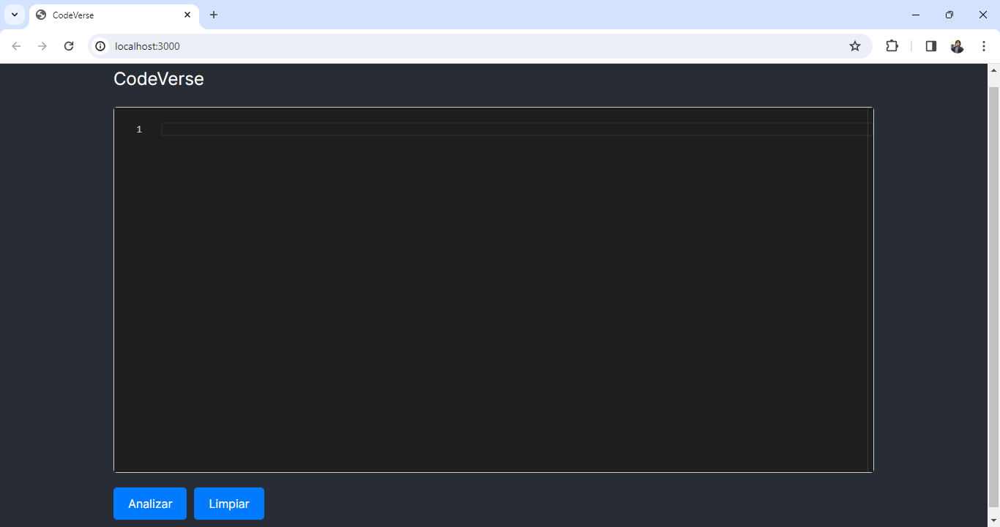

#### INICIAR EL CODIGO

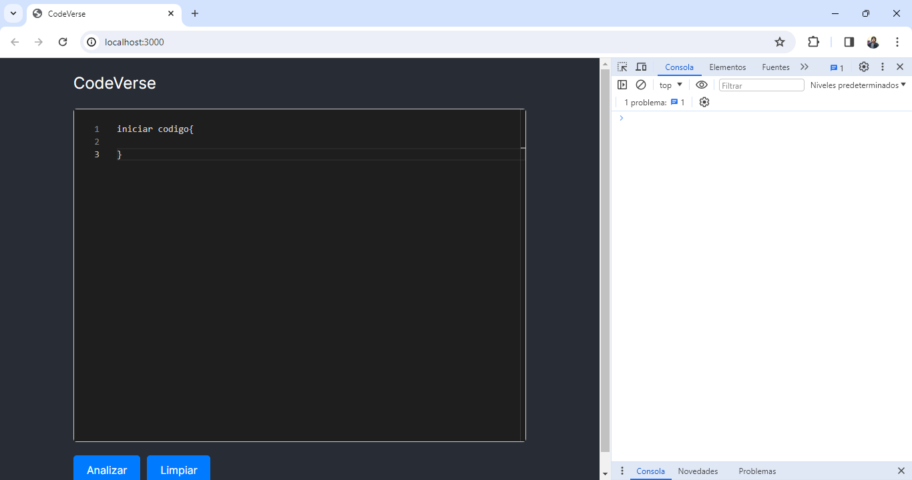

#### DECLARACION DE VARIABLES

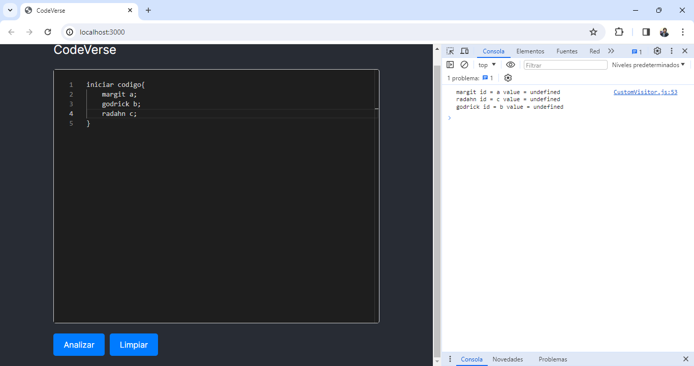

#### DECLARACION DE VARIABLES CON ASIGNACION

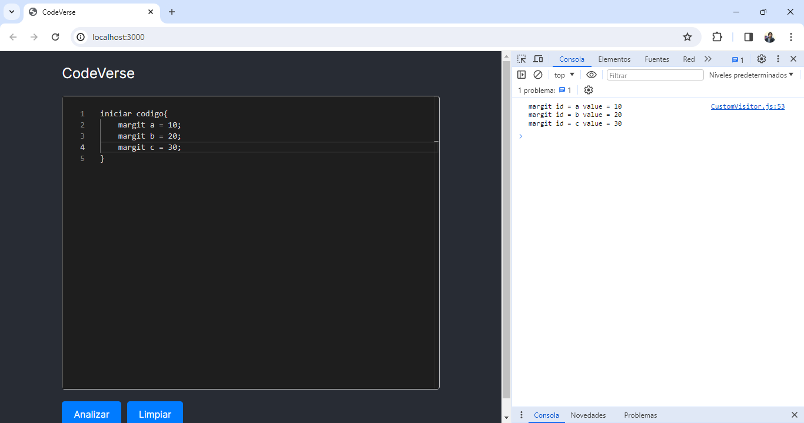

#### IMPRESIONES
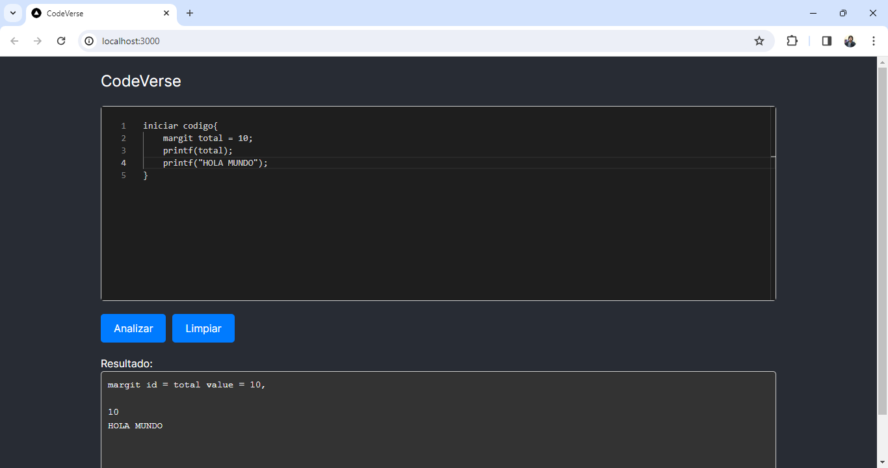

#### OPERACIONES ARITMETICAS
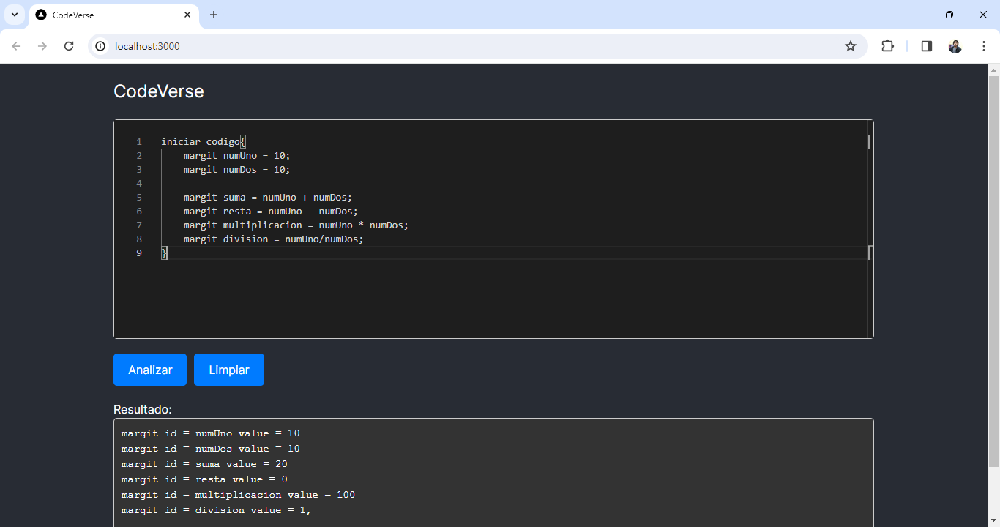

#### MANEJO DE ERRORES
CodeVerse tambien tiene la capacidad de manejar distintos errores como lo son tratar con variables sin antes haber definido, asi como errores sintacticos y errores lexicos, estos errores son generados por el sistema apartir de la gramatica definida en ANTLR, Ejemplo:

#### ASIGNAR VALOR A UNA VARIABLE NO DEFINIDA
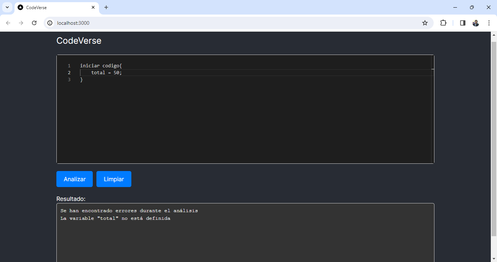

#### IMPRIMIR UNA VARIABLE NO DEFINIDA


#### OPERACION CON UNA VARIABLE NO DEFINIDA
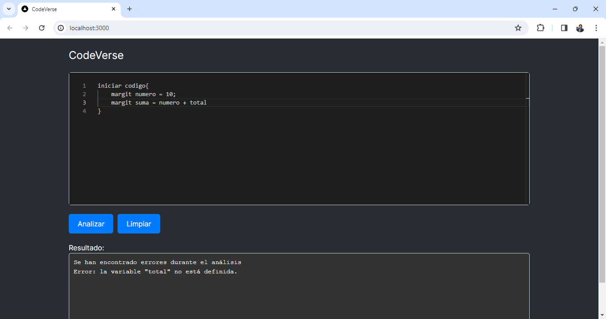

Estos son algunos errores que puede manejar CodeVerse al querer realizar acciones con una variable no definida, como se puede observar el error lo imprime en pantalla para que el usuario lo pueda visualizar y corregir su codigo.
___

#### ERRORES SINTACTICOS Y LEXICOS

#### ERROR SINTACTICO
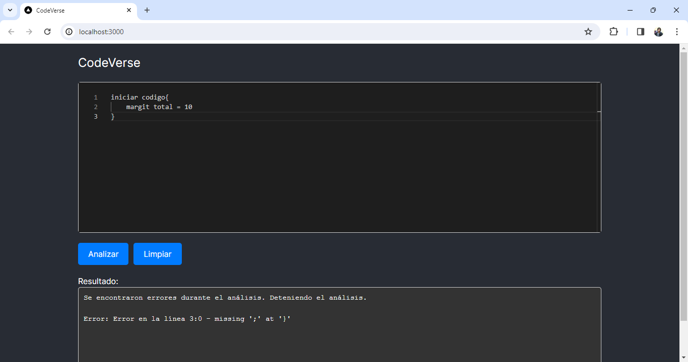

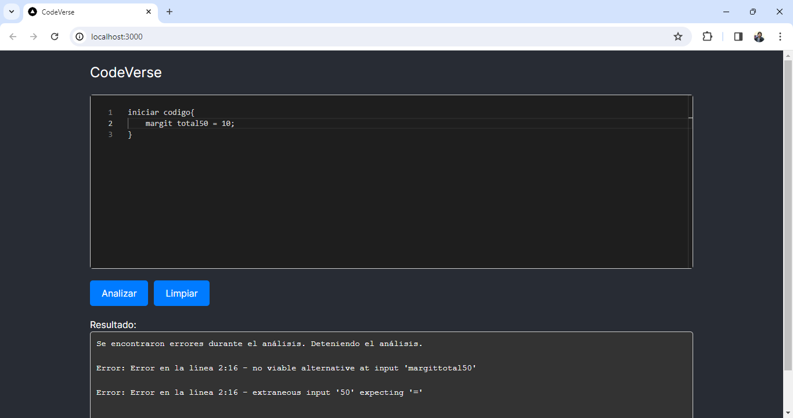

#### ERROR LEXICO
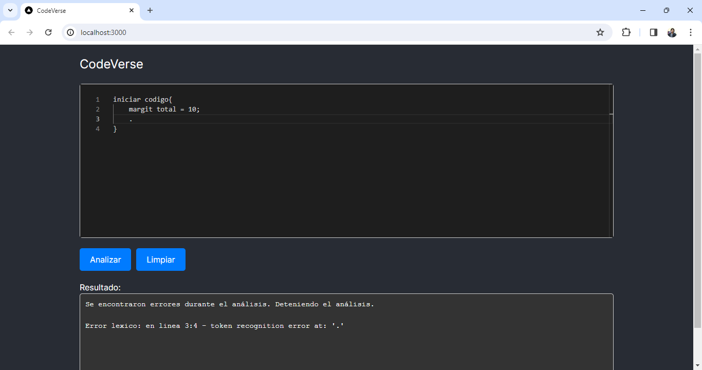

Estos errores sintacticos y lexicos son generados automaticamente por el sistema a partir de la gramatica definida en antlr. Al ingresar una funcion con una escritura erronea el sistema lanza el error ya que la gramatica no reconoce la entrada asi como al intentar ingresar un simbolo no definido en la gramatica se produce un error lexico y se muestra en pantalla
___